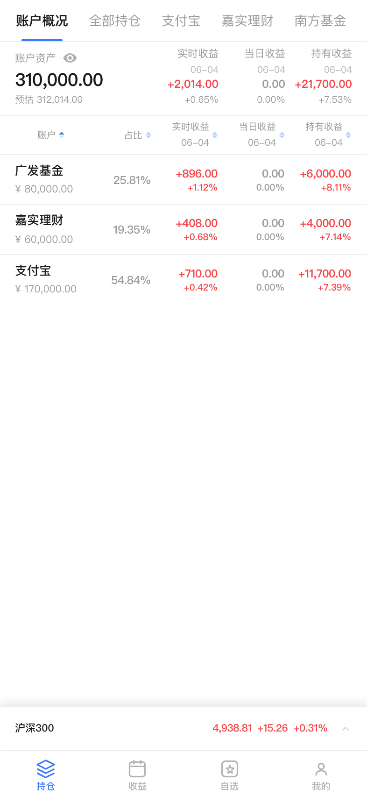
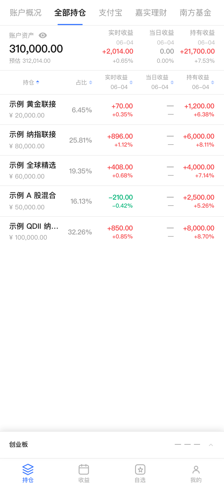
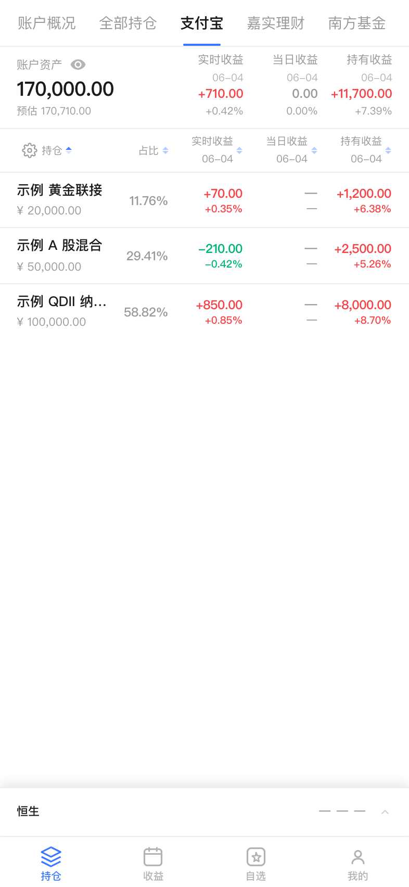
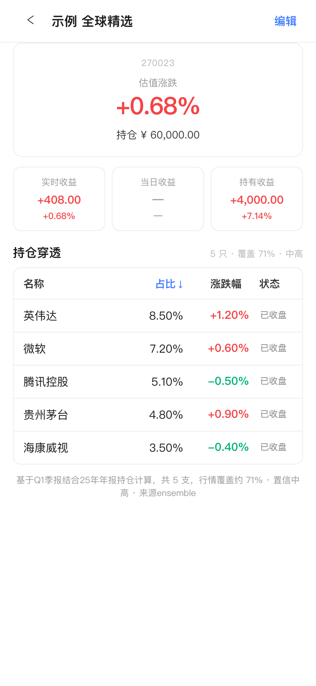
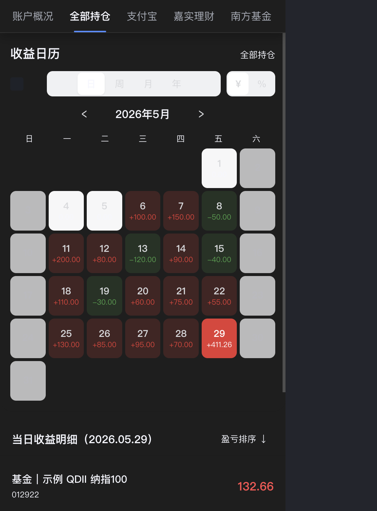
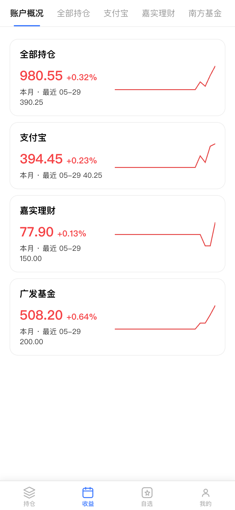
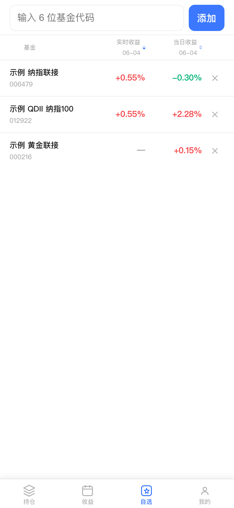
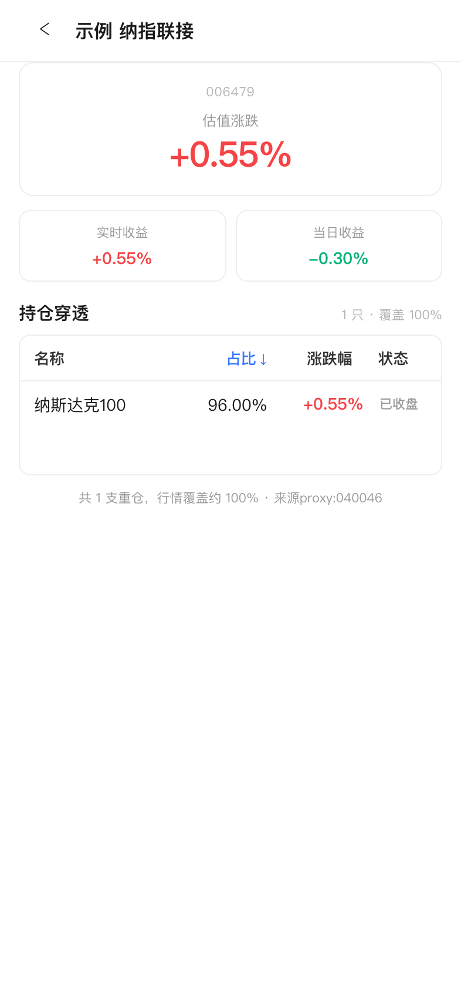
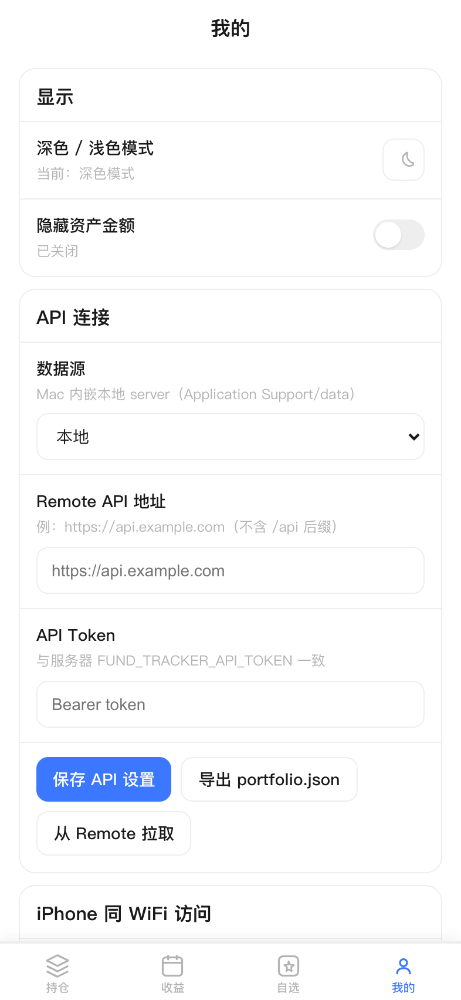

# fund-tracker

**English** — Multi-account mutual-fund portfolio dashboard (Node API + Vite PWA). Aggregates holdings across brokers, shows **settled daily P/L** from official NAV, and **intraday estimated P/L (RT1)** via holdings penetration or index proxies. Session-aware rules for A-share, US QDII, and snap/freeze windows (Beijing time). Optional Mac app (Swift + embedded API), iOS (Capacitor), and WeChat mini program clients.

```bash
npm install && npm run dev    # Web :5178, API :8788
npm run build && PORT=8788 npm start
```

| | |
|--|--|
| Docs (ZH) | [docs/README.md](./docs/README.md) · spec: [realtime-spec.md](./docs/realtime-spec.md) |
| Security | [SECURITY.md](./SECURITY.md) |
| License | [MIT](./LICENSE) |
| Demo data | [scripts/fixtures/screenshot/](./scripts/fixtures/screenshot/) — do not commit real `data/` |

Full README below is in **Chinese** (product UI is Chinese-first).

---

多账户基金持仓看板。聚合各渠道持仓，展示当日收益与盘中实时预估，支持分市场行情、账户概况与大盘指数。

**License:** [MIT](./LICENSE) · **文档**：[docs/README.md](./docs/README.md)  
**Cursor**：[AGENTS.md](./AGENTS.md) — Agent 入口；规则见 [.cursor/rules/](./.cursor/rules/)

## 预览

Mac App（iPhone 15 手机壳 · **浅色** · 统一示例数据 [`scripts/fixtures/screenshot/`](./scripts/fixtures/screenshot/)，由 `npm run screenshot:readme` 生成）。下方按 **持仓 / 收益 / 自选 / 我的** 四区说明；图集见 [`docs/screenshots/`](./docs/screenshots/)。

### 持仓

多账户 Hero + 列表同构：**实时收益 row1**、当日收益、持有收益；顶栏 Tab 切换 **账户概况 / 全部持仓 / 单渠道**。

| 账户概况 | 全部持仓 |
|:---:|:---:|
|  |  |

单渠道视图与 **QDII 重仓穿透**详情（穿透层 live 算，展示层按 session snap / live）：

| 支付宝 · 单渠道 | 基金详情 · 穿透 |
|:---:|:---:|
|  |  |

### 收益

**收益日历**按入账日（creditDay）聚合；**账户汇总**卡片展示各渠道月度/最近入账。

| 收益日历（全部持仓） | 账户收益汇总 |
|:---:|:---:|
|  |  |

### 自选

独立于持仓的观察列表，支持实时估值与穿透详情（无金额列）。

| 自选列表 | 自选详情 |
|:---:|:---:|
|  |  |

### 我的

主题、隐私模式、资产口径与 Remote API 连接（Mac 本地 / VPS 远程）。



## 功能

- 多账户切换：账户概况、全部持仓、单渠道视图
- **实时收益 row1 + 盘前/盘后 row2**（Hero、账户卡、列表三处同构）
- **预估资产**：`账户资产 + 实时收益`（canonical：`baseline + RT1`）
- 当日收益：东财公布净值自动入账
- 实时穿透：重仓估值或联接 proxy；美股 extended 与 regular 拆分
- 分市场会话：A 股、美股 QDII 等按时段 live / snap / 隐藏（`—`）
- 账户概况：各账户资产、实时/当日收益、涨跌家数
- 大盘指数：上证、沪深300、恒生、标普500 等
- 隐私模式、深色 / 浅色主题

## 环境要求

- Node.js 18+
- npm

## 安装与运行

### 开发

```bash
npm install
npm run dev
```

| 服务 | 地址 |
|------|------|
| 前端 | http://localhost:5178 |
| API | http://localhost:8788 |

开发模式下 Vite 将 `/api` 代理至 API 服务。Vite 已配置 `host: true`，同一 Wi‑Fi 下的手机可通过 Mac 局域网 IP 访问（见下文）。

### 生产

```bash
npm install
npm run build
PORT=8788 npm start
```

浏览器访问 `http://<主机>:8788`。Node 同时提供静态页面与 API。

### iPhone / 局域网访问

Mac 与 iPhone 连接**同一 Wi‑Fi** 即可，无需改业务代码。

**推荐（生产，单端口）：**

```bash
npm run build
PORT=8788 npm start
```

在 iPhone Safari 打开：

```text
http://<Mac局域网IP>:8788
```

**开发模式（双端口）：**

```bash
npm run dev
```

iPhone 访问 `http://<Mac局域网IP>:5178`（Vite 会把 `/api` 代理到本机 8788）。

**查 Mac IP：**

```bash
ipconfig getifaddr en0
```

或在 **系统设置 → 网络 → Wi‑Fi → 详细信息** 查看。也可用 `http://<LocalHostName>.local:8788`（如 `http://MacBook-Pro.local:8788`）。

**若打不开：**

- 确认 Mac 上服务已启动，且 iPhone 与 Mac 在同一网络（非访客网络隔离）
- **系统设置 → 网络 → 防火墙**：允许 Node / 终端传入连接
- Mac 合盖休眠会断连，需保持唤醒

**加到主屏幕：** Safari → 分享 → **添加到主屏幕**。从主屏幕打开会全屏显示（无 Safari 地址栏），并自动适配 Dynamic Island / 底部 Home 指示条安全区。

## 持仓数据

首次启动时，若 `data/portfolio.json` 不存在，会从 `src/portfolio.json` 复制示例结构。请将其替换为你自己的持仓，或通过 API / 页面保存。

`data/` 目录说明见 [data/README.md](./data/README.md)。生产部署请挂载 `data/` 以持久化持仓与 **day-display-state** snap。

## 收益说明（摘要）

| 概念 | 说明 |
|------|------|
| **账户资产** | Σ 各基金已入账 `amount` |
| **实时收益** | 穿透 row1；盘前/盘后不含 extended row2 |
| **预估资产** | 账户资产 + header 实时收益合计 |
| **当日收益** | 净值公布后入账的官方盈亏 |

细则见 [docs/realtime-spec.md](./docs/realtime-spec.md)。

**特殊规则**：A 股/黄金联接在 **美股正盘**且 A 股已收市时，实时列显示 `—`。

## 项目结构

```
fund-tracker/
├── apps/          # Mac Swift 壳、Capacitor iOS、微信小程序
├── packages/      # core / api-client / storage 共享包
├── docs/          # 架构、数据流、规格、手册
├── src/           # 前端界面
├── server/        # API、行情、入账、估值与展示状态机
├── data/          # 配置与持久化数据
├── scripts/       # 校准、回测、验收脚本
└── dist/          # 构建输出
```

## API

| 方法 | 路径 | 说明 |
|------|------|------|
| GET | `/api/portfolio` | 读取持仓 |
| PUT | `/api/portfolio` | 更新持仓 |
| GET | `/api/live` | 实时估值、totals、displayState（约 1s 刷新） |
| GET | `/api/live/status` | live 就绪探测 |
| GET | `/api/health` | 健康检查 |
| GET | `/api/watchlist` | 自选列表 |
| GET | `/api/watchlist/live` | 自选实时 |
| GET | `/api/profit/calendar` | 收益日历 |
| GET | `/api/profit/summary` | 收益汇总 |
| GET | `/api/profit/day/:date` | 单日收益明细 |
| GET | `/api/settings` | 读取设置 |
| PUT | `/api/settings` | 更新设置（如资产口径） |
| GET | `/api/fund/:code/detail` | 单基金重仓穿透 |
| GET | `/api/history/daily` | 历史每日汇总 |
| POST | `/api/settle/run` | 净值入账检测 |
| GET | `/api/status` | 服务状态 |

`/api/live` 返回 `totals.baseline`、`displayState.phase`、`displayState.accrualDay` 等，供调试 snap。

## 测试与验收

```bash
npm run test:fund-estimate
npm run test:display-session && npm run test:live-pipeline
npm run test:realtime-profit
npm run test:profit-calendar
npm run verify:alipay-realtime    # 需 API 运行
npm run verify:tab-reconcile
npm run verify:profit-calendar
```

## 估值校准（可选）

```bash
npm run calibrate:valuation
npm run backtest:valuation
```

## 安全

见 [SECURITY.md](./SECURITY.md)。

## 开源与隐私

本项目可公开源码；**请勿提交个人持仓与密钥**。

| 类型 | 处理方式 |
|------|----------|
| 持仓 / 收益 / snap | `data/portfolio.json`、`app-state.json` 等已在 `.gitignore` |
| 估值校准 | 仓库仅含 `data/valuation-profiles.example.json`；本地 `valuation-profiles.json` 不提交 |
| 验收基准 | `scripts/fixtures/*.local.json` 不提交；用 `*.example.json` 作结构参考 |
| API Token | 复制 `.env.example` → `.env`，设置 `FUND_TRACKER_API_TOKEN`；勿写入代码 |
| 远程部署 | 客户端通过 `Authorization: Bearer` 携带 token；`VITE_API_TOKEN` 仅用于构建/本地 |

公开仓库前建议：

```bash
git status   # 确认无 data/*.json（除 example）、无 .env
gitleaks detect --source . -v   # 可选：扫描历史密钥
```

行情数据来自东财、新浪等公开接口，仅供个人学习参考；请遵守各平台服务条款。

## 免责声明

本项目的实时预估与自动入账均来自公开行情与东财数据，仅供参考，不构成投资建议，亦不等同于任何销售平台的清算结果。投资有风险，决策请自行判断。
