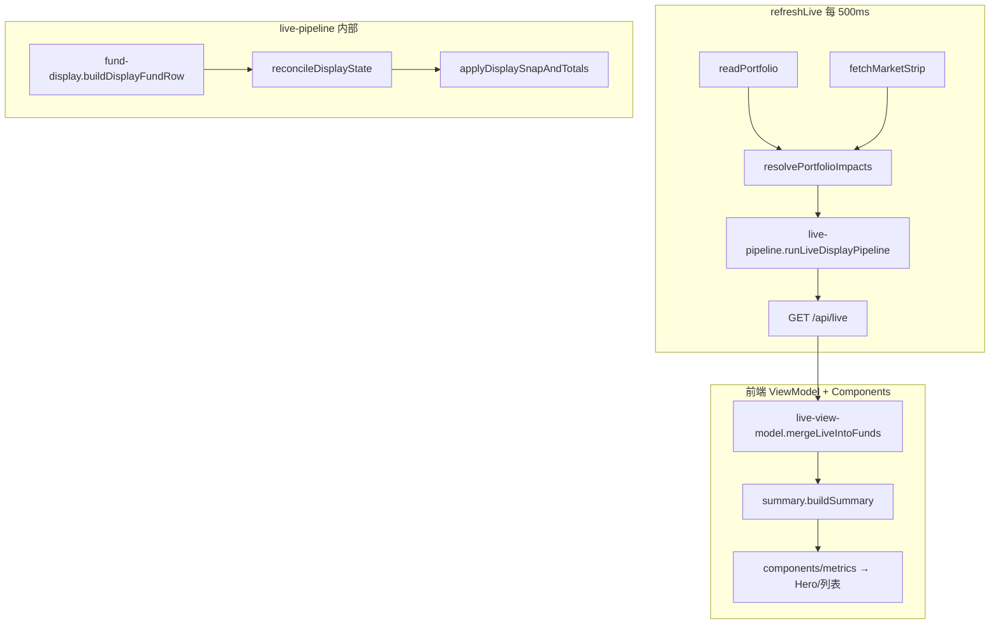
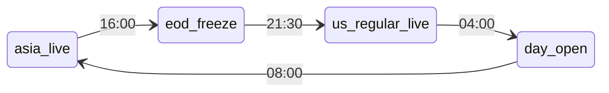

# 数据流

## 1. 主链路（每 500ms）



### Ground truth

| 字段 | 唯一写入点 | 读取方 |
|------|-----------|--------|
| `estimateProfit` (row1) | `fund-display.buildDisplayFundRow` → snap 复制 | API funds、aggregate 求和、前端透传 |
| `realtimeProfit` (header RT1) | `aggregate.computePortfolioTotals` = Σ ep | API totals、前端 SCOPE_ALL Hero |
| `realtimeAssets` (header EST) | `resolvePortfolioRealtimeAssets` → `Σ estimateAssets`；snap 阶段 `applyPortfolioTotalsSnap` | API totals、前端 SCOPE_ALL Hero |
| raw `impactPct*` | `market.js` 穿透 | fund-display 输入 only |

### buildDisplayFundRow 字段来源

| 字段 | 来源 |
|------|------|
| `impactPct` / `impactPctRegular` | `resolveLiveDisplayImpact()` |
| `estimateProfit` | 由 display `impactPct` 推导（非 raw 穿透） |
| `settledProfit` | `nav.js` enrich + portfolio |
| `realtimeActive` | `getFundProfitWindows`；美股正盘时 A 股可为 false |

## 2. 金额字段定义

| 字段 | 含义 | 更新时机 |
|------|------|----------|
| `amount` | 账户资产（已入账净值口径） | NAV 入账、手动编辑 |
| `settledProfit` / `yesterdayProfit` | 当日官方收益 | NAV 入账 |
| `estimateProfit` | 实时收益 row1 | 穿透 / snap |
| `realtimeAssets` | 预估资产 | `Σ estimateAssets` 或 snap 阶段 `baseline+RT1` |
| `baseline` | 入账资产\_{D−1} | 日切 / ensureDayBaseline |

### Header 预估

**后端 canonical**（portfolio / 账户 scope，live 阶段）：

```javascript
// per-fund: fundEstimatedAssets → amount + ep（禁止 amount−settled+ep）
// aggregate.computePortfolioTotals
realtimeAssets = resolvePortfolioRealtimeAssets → Σ per-fund estimateAssets
realtimeProfit = Σ estimateProfit
```

snap 阶段 portfolio 仍可用 `baseline + realtimeProfit` 防止入账跳变。

**前端**：

```javascript
// SCOPE_ALL：API live.totals.realtimeAssets
// 账户 scope：totalsByAccount[id].realtimeAssets 或 buildSummary(canonicalTotals)
// fallback：Σ estimateAssets 或 amount+ep — 禁止 amount−settled+ep
```

## 3. 展示 phase（北京时间）

与 `display-session.inferDisplayPhaseFromClock` 一致（详见 [realtime-spec.md §7](./realtime-spec.md)）：

| 时段 (BJ) | phase | RT1 / row1 |
|-----------|-------|------------|
| 08:00–16:00 | `asia_live` | 有 regular 持仓则 live，否则 snap |
| 16:00–21:30 | `eod_freeze` | **eodSnap** |
| 21:30–04:00 | `us_regular_live` | live（仅正盘持仓计入 RT1） |
| 04:00–08:00 | `day_open` | per-fund 门控 + snap |

穿透层可能仍携带 `impactPctExtended` 字段；**当前展示会话不以盘前/盘后独立 freeze**，header RT1 以 `estimateProfit` / snap 为准。

## 4. 展示状态机



实现入口：`live-pipeline.runLiveDisplayPipeline()` → `reconcileDisplayState` → `applyDisplaySnapAndTotals`。

### 钩子

| 事件 | 行为 |
|------|------|
| 进入 `eod_freeze` | 写入 / 保留 `eodSnap`（per-fund rt1、`amountAtSnap`） |
| 21:30 US regular | phase=`us_regular_live`，RT1 live |
| settle NAV | 仅更新 `portfolio.json`；**不** clear snap |
| 截图模式 | `FUND_TRACKER_SCREENSHOT=1` 跳过自动入账写回 portfolio |

## 5. 持久化

| 文件 | 内容 |
|------|------|
| `data/portfolio.json` | 持仓 amount、份额、净值日 |
| `data/day-display-state.json` | `baseline`、`eodSnap`、`currentPhase`、`rt1AccrualDay` |
| `data/impact-snapshots.json` | 穿透 `impactPctRegular`（按 fundId） |
| `data/app-state.json` | `intradayTicks`（调试留存）、`dailyRecords` |
| `data/valuation-profiles.json` | 估值策略（本地生成，见 example） |

### day-display-state 结构（简化）

```json
{
  "currentBeijingDate": "2026-05-29",
  "currentPhase": "eod_freeze",
  "rt1AccrualDay": "2026-05-29",
  "days": {
    "2026-05-29": {
      "baseline": { "portfolio": 310000 },
      "scopes": {
        "portfolio": {
          "baseline": 310000,
          "eodSnap": {
            "rt1": 2014,
            "est": 312014,
            "funds": { "1": { "rt1": 850, "amountAtSnap": 100000 } }
          }
        }
      }
    }
  }
}
```

完整示例见 [`scripts/fixtures/screenshot/day-display-state.json`](../scripts/fixtures/screenshot/day-display-state.json)。

### rt1AccrualDay

北京时间 **00:00–04:00** 仍属前一 accrual 日（US 正盘尾段），**0:00 只滚 baseline，RT1 不归零**。

## 6. API `/api/live` 要点

```json
{
  "beijingDate": "2026-05-27",
  "updatedAt": "22:07:45",
  "funds": [{ "id": 2, "code": "022364", "estimateProfit": null, "impactPct": null }],
  "totals": {
    "settledAssets": 310000,
    "realtimeProfit": -120,
    "realtimeAssets": 309880,
    "baseline": 300000,
    "estimateFrozen": false
  },
  "displayState": {
    "accrualDay": "2026-05-27",
    "phase": "us_regular_live",
    "snapKey": null
  },
  "displayContext": {
    "marketChip": "盘中 · 美股"
  }
}
```

## 7. 特殊规则（已实现）

### A 股 / 黄金联接 + 美股正盘

`classifyFundMarket` 将黄金联接归为 `cn`。在 **美股正盘**（21:30–04:00）且 A 股已收市时：

- `impactPct` / `estimateProfit` = **null**
- 列表与 Hero 显示 **`—`**，不展示 A 股收盘 snapshot

### 顶栏市场标签

`openMarketLabels()` 输出：`A股`、`港股`、`亚太`、`美股`。**不**单独输出「黄金」。

## 8. 晚启动 snap seed

服务在 `eod_freeze`（16:00–21:30）或 `day_open`（04:00–08:00）首次启动且无 ready snap 时，`reconcileDisplayState` 直接用当前 live 行 seed `eodSnap`（`seedEodSnap`）。

> 历史 `tryBackfillSnapFromTicks()`（从 `intradayTicks` 回填 16:00 前快照）已废弃为 no-op，不在管线中调用；`intradayTicks` 现仅作调试留存。
