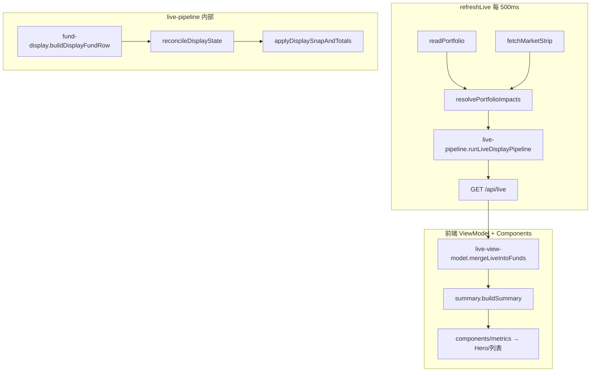
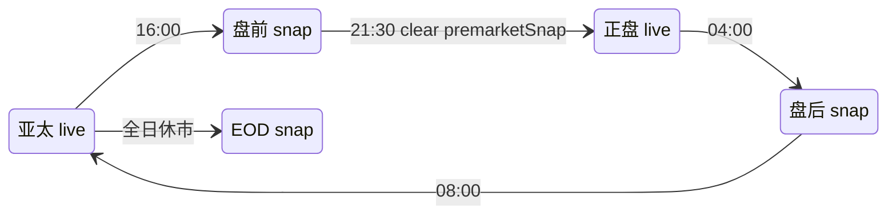

# 数据流

## 1. 主链路（每 500ms）



### Ground truth

| 字段 | 唯一写入点 | 读取方 |
|------|-----------|--------|
| `estimateProfit` (row1) | `fund-display.buildDisplayFundRow` → snap 复制 | API funds、aggregate 求和、前端透传 |
| `realtimeProfit` (header RT1) | `aggregate.computePortfolioTotals` = Σ ep | API totals、前端 SCOPE_ALL Hero |
| `realtimeAssets` (header EST) | `applyPortfolioTotalsSnap` = baseline + RT1 | API totals、前端 SCOPE_ALL Hero |
| raw `impactPct*` | `market.js` 穿透 | fund-display 输入 only |

### buildDisplayFundRow 字段来源

| 字段 | 来源 |
|------|------|
| `impactPct` / `impactPctRegular` | `resolveLiveDisplayImpact()` |
| `estimateProfit` | 由 display `impactPct` 推导（非 raw 穿透） |
| `realTimeProfitExtended` | `impactPctExtendedLive × amount` |
| `settledProfit` | `nav.js` enrich + portfolio |
| `realtimeActive` | `getFundProfitWindows`；美股正盘时 A 股可为 false |

## 2. 金额字段定义

| 字段 | 含义 | 更新时机 |
|------|------|----------|
| `amount` | 账户资产（已入账净值口径） | NAV 入账、手动编辑 |
| `settledProfit` / `yesterdayProfit` | 当日官方收益 | NAV 入账 |
| `estimateProfit` | 实时收益 row1 | 穿透 / snap |
| `realTimeProfitExtended` | 盘前/盘后 row2 | 仅 extended 时段 live |
| `realtimeAssets` | 预估资产 | `Σ estimateAssets` 或 snap 阶段 `baseline+RT1` |
| `baseline` | 入账资产\_{D−1} | 日切 / ensureDayBaseline |

### Header 预估

**后端 canonical**（portfolio / 账户 scope，live 阶段）：

```javascript
// per-fund: fundEstimatedAssets → amount + ep（禁止 amount−settled+ep）
// aggregate.computePortfolioTotals
realtimeAssets = resolvePortfolioRealtimeAssets → Σ per-fund estimateAssets
realtimeProfit = Σ estimateProfit
```

snap 阶段 portfolio 仍可用 `baseline + realtimeProfit` 防止入账跳变。

**前端**：

```javascript
// SCOPE_ALL：API live.totals.realtimeAssets
// 账户 scope：totalsByAccount[id].realtimeAssets 或 buildSummary(canonicalTotals)
// fallback：Σ estimateAssets 或 amount+ep — 禁止 amount−settled+ep
```

## 3. 美股 extended 拆分

```
raw impactPct (total)
    ├── impactPctRegular  → row1 / RT1 / header
    └── impactPctExtended → row2（盘前/盘后，不计入 header）
```

| 时段（北京） | row1 | row2 |
|--------------|------|------|
| 16:00–21:30 盘前 | snap | live |
| 21:30–04:00 正盘 | live (regular+extended) | — |
| 04:00–08:00 盘后 | snap（正盘定稿） | live |

## 4. 展示状态机



实现入口：`live-pipeline.runLiveDisplayPipeline()` → 内部 `components/snap-seed.reconcileDisplayState()`。

### 钩子

| 事件 | 行为 |
|------|------|
| 首次进入 premarket/afterhours | 写入 `premarketSnap` / `afterhoursSnap` |
| 21:30 US regular | `clearScopeSnap(premarketSnap)`，phase=`us_regular_live` |
| 08:00+ 休市 | 写入 `eodSnap`（若缺失） |
| settle NAV | 仅更新 portfolio；**不** clear snap |

## 5. 持久化

| 文件 | 内容 |
|------|------|
| `data/portfolio.json` | 持仓 amount、份额、净值日 |
| `data/day-display-state.json` | `baseline`、`premarketSnap`、`afterhoursSnap`、`eodSnap`、`currentPhase` |
| `data/impact-snapshots.json` | 穿透 `impactPctRegular`（按 fundId） |
| `data/app-state.json` | `intradayTicks`（backfill 用）、`dailyRecords` |
| `data/valuation-profiles.json` | 估值策略（本地生成，见 example） |

### day-display-state 结构（简化）

```json
{
  "currentBeijingDate": "2026-05-27",
  "currentPhase": "us_regular_live",
  "rt1AccrualDay": "2026-05-27",
  "days": {
    "2026-05-27": {
      "baseline": { "portfolio": 300000 },
      "scopes": {
        "portfolio": {
          "baseline": 300000,
          "premarketSnap": {
            "rt1": 1200,
            "est": 301200,
            "funds": { "2": { "rt1": -80, "amountAtSnap": 50000 } }
          }
        }
      }
    }
  }
}
```

### rt1AccrualDay

北京时间 **00:00–04:00** 仍属前一 accrual 日（US 正盘尾段），**0:00 只滚 baseline，RT1 不归零**。

## 6. API `/api/live` 要点

```json
{
  "beijingDate": "2026-05-27",
  "updatedAt": "22:07:45",
  "funds": [{ "id": 2, "code": "022364", "estimateProfit": null, "impactPct": null }],
  "totals": {
    "settledAssets": 310000,
    "realtimeProfit": -120,
    "realtimeAssets": 309880,
    "baseline": 300000,
    "estimateFrozen": false
  },
  "displayState": {
    "accrualDay": "2026-05-27",
    "phase": "us_regular_live",
    "snapKey": null
  },
  "displayContext": {
    "marketChip": "盘中 · 美股"
  }
}
```

## 7. 特殊规则（已实现）

### A 股 / 黄金联接 + 美股正盘

`classifyFundMarket` 将黄金联接归为 `cn`。在 **美股正盘**（21:30–04:00）且 A 股已收市时：

- `impactPct` / `estimateProfit` = **null**
- 列表与 Hero 显示 **`—`**，不展示 A 股收盘 snapshot

### 顶栏市场标签

`openMarketLabels()` 输出：`A股`、`港股`、`亚太`、`美股`。**不**单独输出「黄金」。

## 8. 晚启动 backfill

服务在 16:00 之后首次启动时，`tryBackfillSnapFromTicks()` 从 `app-state.json` 的 `intradayTicks` 找 `updatedAt ≤ 16:00` 的最后一条，避免用 21:00 live 值当初始 snap。
