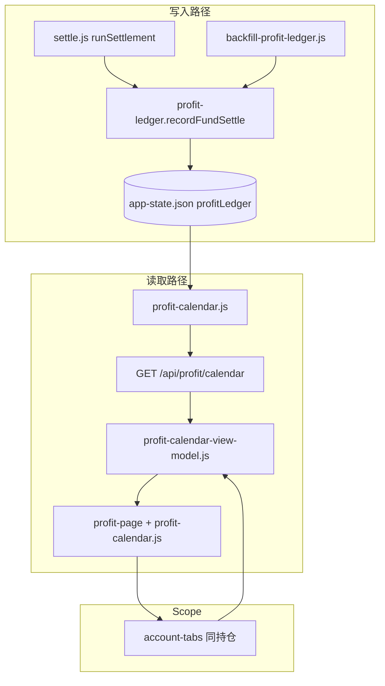

# 收益日历功能规格

> 对标蚂蚁财富「收益明细 → 收益日历」；与持仓页共用 **scope 切换**（账户概况 / 全部持仓 / 单账户），口径以 **已入账官方收益** 为准，非实时 RT1。

## 1. 目标与边界

### 1.1 产品目标

| 目标 | 说明 |
|------|------|
| 收益 Tab | 底部导航新增 **「收益」**，与「持仓 / 自选 / 行情 / 我的」并列 |
| Scope 一致 | 顶部 **账户 Tab 栏** 与持仓页相同：`账户概况` · `全部持仓` · 各账户 |
| 月历视图 | 默认 **月视图** 网格（日格显示 ¥ 或 %），红涨绿跌、零/未更新灰显 |
| 支付宝对标 | 支付宝账户 scope 逐日误差 **≤ ±500 元**（近两周合计 **≤ 0.5%**） |
| 多账户 | 嘉实 / 南方 / 广发等独立日历；「全部持仓」= 各账户同日求和 |

### 1.2 不在 v1 范围

- 实时收益日历（RT1 按日回放）— 与支付宝「收益日历」口径不同，另开规格
- 交易记录、申购赎回归因 — 仅展示 **净值入账产生的 settledProfit**
- 图表视图（周/年折线）— Phase 2
- 单基金 drill-down 日历 — Phase 2（数据结构预留 `funds` 明细）

### 1.3 与实时看板的区别

| 维度 | 持仓 Hero / 列表 | 收益日历 |
|------|------------------|----------|
| 数据 | `estimateProfit` / RT1 / EST | **`settledProfit`（官方入账）** |
| 时间轴 | 当前会话 + snap | **北京日历日 `creditDay`** |
| 更新 | 500ms live tick | 净值入账 + 日切 snapshot |
| 周末 | live / suppress 规则 | 无入账则 **0 或「未更新」** |

---

## 2. Scope 模型（与持仓对齐）

复用 `src/accounts.js` 常量与 Tab 栏组件，**收益页与持仓页共享 `activeScope`**（同一 `localStorage` key）。

| Scope | ID | 日历数据 |
|-------|-----|----------|
| 账户概况 | `summary` | **不显示月历**；展示各账户 **本月 / 近 7 日 / 近 30 日** 汇总卡片 + 点击进入该账户日历 |
| 全部持仓 | `all` | 各账户同日 `settledProfit` **直接求和**（**不** `mergeFundsByCode`） |
| 单账户 | `alipay` 等 | 该 `accountId` 下所有 fund 行 `settledProfit` 求和 |

### 2.1 为何全部持仓不求 merge by code

持仓列表 merge 是为 **跨账户同 code 合并展示**；支付宝收益日历是 **账户级合计**。日历 scope=`all` 时：

```
dayProfit(all, D) = Σ dayProfit(accountId, D)
```

若两账户持有同 code，日历 **加总两份持仓** 的入账，与分别看两账户再心算一致。

### 2.2 路由与 Hash

与持仓平行，增加 `mainTab: 'profit'`：

| Hash | 含义 |
|------|------|
| `#profit` | 收益 Tab + 上次 scope |
| `#profit/summary` | 账户概况 |
| `#profit/all` | 全部持仓 |
| `#profit/account/alipay` | 支付宝账户 |

解析入口：`main.js` `parseHash()` 扩展；`navigateTo({ type: 'profit', scope, mainTab: 'profit' })`。

### 2.3 UI 结构

```
┌─────────────────────────────────────┐
│  Hero：本月累计 / 选中月累计          │  ← scope 内 canonical
├─────────────────────────────────────┤
│  [账户概况][全部持仓][支付宝]…       │  ← 复用 account-tabs.js
├─────────────────────────────────────┤
│  ◀  2026年5月  ▶   [¥] [%]          │  ← 月切换 + 单位
│  日 一 二 三 四 五 六                 │
│  ┌──┬──┬──┬──┬──┬──┬──┐            │
│  │  │  │  │1 │2 │3 │  │            │  ← profit-calendar.js
│  └──┴──┴──┴──┴──┴──┴──┘            │
│  选中：5/29  +16,395.06  +0.99%     │  ← 底部解读条
└─────────────────────────────────────┘
│ 持仓 │ 收益 │ 自选 │ 行情 │ 我的    │  ← bottom-tabs 新增「收益」
└─────────────────────────────────────┘
```

**账户概况**模式：Hero 改为「全账户本月合计」；主体为 **账户卡片列表**（每卡：本月收益、最近一日、sparkline 可选 Phase 2），点击 `activateAccountScope` 并切到 `#profit/account/{id}`。

---

## 3. 口径：收益归属日（creditDay）

### 3.1 定义

**日历格子的日期 = `creditDay`（北京日历日）**，值为当日 scope 内 **所有基金入账收益之和**。

与 `settle.js` 运行时行为一致：入账发生在 **`beijingDateString()` 当天**，写入 `fund.yesterdayProfit` 并触发 `recordLiveSnapshot`。

### 3.2 支付宝对齐规则（历史回填 & 验收）

对 **已公布净值日 `navDate`** 的单步收益 `Δ = shares × prevNav × pct/100`：

| 基金市场 | creditDay |
|----------|-----------|
| A 股 / 黄金联接（`market=cn` 或 code 在 cn 集合） | **`navDate`** |
| QDII / 美股穿透 | **`navDate` 的下一个中国交易日**（跳过周六日；周一合并周末多笔 NAV） |

> 实测（2026-05 支付宝 alipay 账户）：近两周合计误差 **+0.36%**；5/18–5/29 逐日多数 **±500 元** 内；5/29 差 **1.6 元**。

### 3.3 收益率（%）

与 Hero 当日收益率一致，复用 `dayProfitPct`：

```javascript
settledProfitPct = profit / (settledAssets - profit) × 100
```

其中 **`settledAssets` = 该日入账完成后的 scope 内 Σ amount**（非实时 EST）。

**周 / 月 / 年 % 视图**：`区间 Σprofit / 区间起始日期前最近一期末资产 × 100`（与单日公式同口径，期初资产取 `from` 日前最后一笔入账日的 `settledAssets`）。

### 3.4 特殊日态

| 状态 | 条件 | UI |
|------|------|-----|
| `zero` | creditDay 无入账且非未来 | `0.00` 灰色 |
| `pending` | 今日尚未入账、且已过可入账窗口 | 「未更新」灰色（对标支付宝「今,未更新」） |
| `future` | 日期 > 今天 | 空格 / 禁用 |
| `missing` | 历史无记录且应有交易 | 空；回填任务补齐 |

**pending 判定**：`creditDay === today` 且 portfolio 存在 `lastNavDate < 预期 navDate` 的 fund，且当日 `settledProfit` 尚未写入 ledger。

---

## 4. 数据模型

### 4.1 存储位置

扩展 `data/app-state.json`，新增 **`profitLedger`**（与 `dailyRecords` 解耦；后者含 snap 体积大且为 portfolio 级 live 快照）。

```json
{
  "profitLedger": {
    "days": {
      "2026-05-29": {
        "creditDay": "2026-05-29",
        "accounts": {
          "alipay": {
            "settledProfit": 1200.5,
            "settledAssets": 310000,
            "settledProfitPct": 0.39
          },
          "jiashi": { "settledProfit": 550, "settledAssets": 120000, "settledProfitPct": 0.46 }
        },
        "portfolio": {
          "settledProfit": 1750.5,
          "settledAssets": 430000,
          "settledProfitPct": 0.41
        },
        "funds": {
          "1": { "accountId": "alipay", "code": "012922", "settledProfit": 800 },
          "2": { "accountId": "alipay", "code": "022364", "settledProfit": 400.5 }
        },
        "source": "settle",
        "updatedAt": "2026-05-29T08:12:03.000Z"
      }
    },
    "meta": {
      "schemaVersion": 1,
      "lastBackfillAt": "2026-05-29T12:00:00.000Z",
      "backfillThrough": "2026-05-29"
    }
  }
}
```

### 4.2 Single writer

| 字段 | 唯一写入 | 说明 |
|------|----------|------|
| `profitLedger.days[D].funds[id].settledProfit` | **`profit-ledger.recordFundSettle()`** | settle 事件 per-fund |
| `profitLedger.days[D].accounts[aid]` | **`profit-ledger.rebuildDayAccounts()`** | Σ funds by accountId |
| `profitLedger.days[D].portfolio` | **`profit-ledger.rebuildDayPortfolio()`** | Σ accounts |
| 历史回填 | **`scripts/backfill-profit-ledger.js`** | 只写 `source: backfill` 的日 |

**禁止**前端或 aggregate 从 lsjz 重算日历；读 API 已聚合好的 scope 视图。

### 4.3 与现有 `dailyRecords` 关系

| 字段 | dailyRecords | profitLedger |
|------|--------------|--------------|
| 粒度 | portfolio | portfolio + **account + fund** |
| settledProfit | ✓ | ✓（portfolio 应一致） |
| snap / RT1 | ✓ | ✗ |
| 用途 | live 日切、Hero 历史 | **收益日历专用** |

迁移：首次启动时，将已有 `dailyRecords[*].settledProfit` 灌入 `profitLedger.days[*].portfolio`（accounts 为空则标记需回填）。

---

## 5. 后端

### 5.1 模块

```
server/
├── profit-ledger.js       # 读写 profitLedger；recordFundSettle；scope 聚合
├── profit-calendar.js     # 月视图 DTO；pending/zero 状态
├── profit-attribution.js  # creditDay 规则（cn / qdii）；回填用
└── profit-ledger.test.js
```

### 5.2 settle 挂钩

在 `settle.js` `runSettlement` 入账成功后（`recordLiveSnapshot` 之前或并行）：

```javascript
for (const ev of events.filter(e => e.status === 'settled')) {
  await recordFundSettle({
    fundId: ev.fundId,
    accountId: fund.accountId,
    code: fund.code,
    creditDay: beijingDateString(),       // 运行时 = 入账日
    navDate: ev.navDate,
    settledProfit: ev.profit,
    settledAssetsAfter: fund.amount,
  });
}
```

运行时 **creditDay 恒为当日 beijingDate**（与支付宝 QDII 下一交易日展示在「更新日」一致，无需再偏移）。

### 5.3 API

#### `GET /api/profit/calendar`

| Query | 说明 |
|-------|------|
| `scope` | `summary` \| `all` \| `{accountId}` |
| `month` | `YYYY-MM`（默认当月北京月） |
| `unit` | `amount`（默认）\| `pct` |

**Response**

```json
{
  "scope": "alipay",
  "scopeLabel": "支付宝",
  "month": "2026-05",
  "unit": "amount",
  "monthTotal": { "profit": 8500.0, "profitPct": 5.42 },
  "days": [
    { "date": "2026-05-01", "profit": 0, "profitPct": 0, "status": "zero" },
    { "date": "2026-05-29", "profit": 1200.5, "profitPct": 0.998, "status": "settled" },
    { "date": "2026-05-30", "profit": null, "profitPct": null, "status": "future" }
  ],
  "selectedDay": "2026-05-29",
  "updatedAt": "2026-05-29T08:12:03.000Z"
}
```

#### `GET /api/profit/summary`（账户概况）

```json
{
  "month": "2026-05",
  "portfolioMonthTotal": 95000.12,
  "accounts": [
    { "accountId": "alipay", "name": "支付宝", "monthProfit": 8500.0, "lastDay": "2026-05-29", "lastDayProfit": 1200.5 }
  ]
}
```

#### `POST /api/profit/backfill`（仅 dev / 脚本）

Body: `{ "from": "2026-05-01", "to": "2026-05-29", "accountId": "alipay" | null }`  
触发 lsjz 回填，返回 diff report。

### 5.4 Scope 聚合（读路径）

```javascript
function sumScopeDay(scope, dayRow) {
  if (scope === 'all') return dayRow.portfolio;
  if (scope === 'summary') throw new Error('use /api/profit/summary');
  return dayRow.accounts[scope] ?? null;
}
```

---

## 6. 历史回填

### 6.1 脚本 `scripts/backfill-profit-ledger.js`

1. 读取 `portfolio.json` 当前 **shares**（用户确认近两周无大额申赎；更早月份误差可接受）
2. 东财 lsjz 拉取各 code 净值序列
3. 逐步计算 `Δprofit`，按 §3.2 规则映射 `creditDay`
4. 按 fund 累加到 `profitLedger`；重建 account / portfolio
5. 输出与支付宝验收 CSV 的 diff

### 6.2 份额漂移

若某 interval 内发生申赎，回填误差集中在 **申赎日前后**。v1 策略：

- 默认恒定 shares；文档注明限制
- Phase 2：读取 `portfolio.meta` 或未来 `transactions[]` 做 PIT shares

---

## 7. 前端

### 7.1 新文件

```
src/
├── pages/profit-page.js           # render + patchProfitDom
├── profit-calendar-view-model.js  # API → calendar model
├── components/profit-calendar.js  # 月网格、月切换、单位切换
└── components/profit-hero.js      # 本月累计 / 选中日解读
```

### 7.2 状态（main.js）

```javascript
profitCalendar: {
  month: '2026-05',      // YYYY-MM
  unit: 'amount',        // localStorage persist
  selectedDay: null,
  data: null,            // last API payload
  loading: false,
  error: null,
}
```

`activeScope` 变更 → 重新 `fetchProfitCalendar()`。  
`mainTab === 'profit'` 时 **不跑 500ms live refresh**（仅入账后 manual refresh 或日切 poll）。

### 7.3 组件复用

| 现有 | 收益页 |
|------|--------|
| `account-tabs.js` | 原样；`activateAccountScope` 增加 `mainTab` 参数 |
| `display-format.js` | 金额脱敏 |
| `format.js` | pct |
| `bottom-tabs.js` | 新增 `{ id: 'profit', label: '收益', hash: '#profit' }` |

### 7.4 配色（对标支付宝）

| 值 | 色 |
|----|-----|
| profit > 0 | `--color-up`（红） |
| profit < 0 | `--color-down`（绿） |
| 0 / pending | `--text-tertiary` |
| 选中格 | 深红底 + 白字 |

---

## 8. 实施分期

### Phase 1 — MVP（对标验收）

- [ ] `profit-ledger.js` + settle 挂钩
- [ ] `GET /api/profit/calendar` + `summary`
- [ ] 回填脚本 + alipay 2026-05 验收
- [ ] 底部 Tab + 收益页 + scope Tab + 月历 ¥
- [ ] `npm run verify:profit-calendar`

### Phase 2 — 体验

- [ ] `%` 单位切换
- [ ] 账户概况卡片 + sparkline
- [ ] 周 / 年视图 + 简易折线图
- [ ] 点击某日 → 当日各 fund 明细 bottom sheet

### Phase 3 — 完整性

- [ ] 申赎 PIT shares 回填
- [ ] PG 持久化（若 app-state 体积超限）
- [ ] 导出 CSV / 与支付宝截图 diff 工具

---

## 9. 测试与验收

### 9.1 单元测试

| 文件 | 覆盖 |
|------|------|
| `profit-attribution.test.js` | creditDay：cn 同日、qdii 下一交易日、周一合并 |
| `profit-ledger.test.js` | recordFundSettle、scope 聚合、与 dailyRecords 一致 |
| `profit-calendar.test.js` | 月边界、pending/future、空月 |

### 9.2 验收脚本 `npm run verify:profit-calendar`

1. 读取 `scripts/fixtures/alipay-may-2026.local.json`（私有；example 见同目录）
2. 调 API `scope=alipay&month=2026-05`
3. 断言关键日 ±500 元、近两周合计 ±0.5%
4. 断言 `5/29` 与 `Σ yesterdayProfit` 一致

### 9.3 手动清单

- [ ] 切换 scope：支付宝 ↔ 全部 ↔ 嘉实，数字随 scope 变化
- [ ] 与支付宝 App 同月逐日肉眼对比（至少 10 个交易日）
- [ ] 入账后刷新，今日格从 pending → 数值
- [ ] 隐私模式：日历金额脱敏

---

## 10. 架构图



---

## 11. 风险与决策记录

| 决策 | 理由 |
|------|------|
| 独立 `profitLedger` 而非扩 `dailyRecords` | 避免 snap 膨胀；支持 account/fund 粒度 |
| scope=all 不求 merge by code | 日历是账户资产合计，不是持仓代码维度 |
| 历史回填用恒定 shares | 用户确认近期无大额申赎；实现简单 |
| QDII 回填用下一中国交易日 | 与支付宝 2026-05 实测最佳吻合 |
| 运行时 creditDay=beijingDate | settle 实际入账日即支付宝展示日 |

---

## 12. 相关文档

- [realtime-spec.md](./realtime-spec.md) — RT1/EST（**非**日历口径）
- [data-flow.md](./data-flow.md) — settle、`dailyRecords`
- [frontend-architecture.md](./frontend-architecture.md) — scope、组件分层
- [development.md](./development.md) — 验收命令（待补充 `verify:profit-calendar`）
